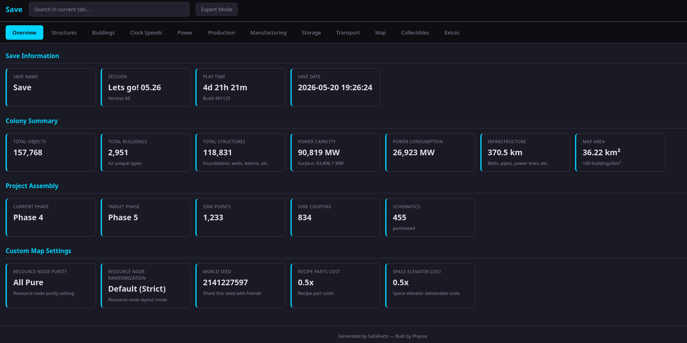
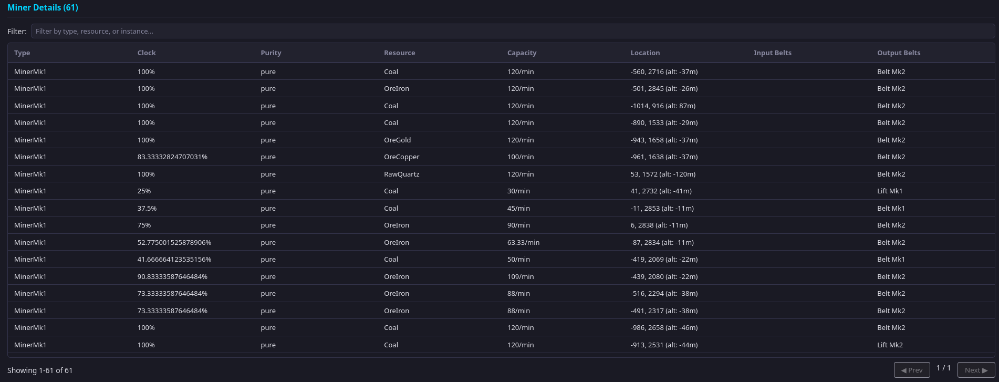
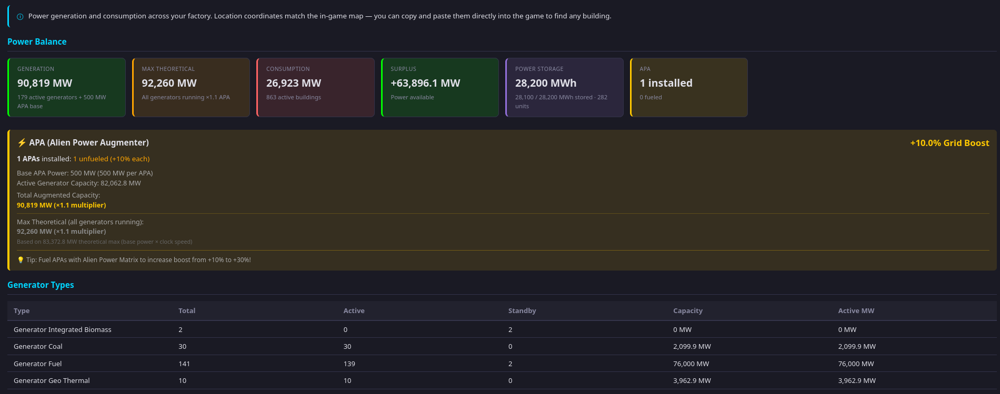
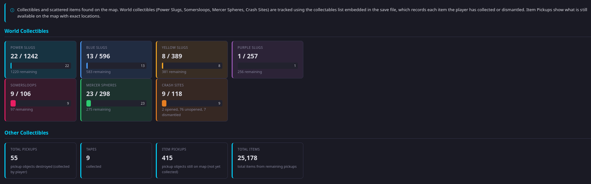

# SatisFacts

**Developed by Physox**

Parses Satisfactory save files and generates detailed HTML reports with power grid, production, storage, transport, collectibles, and more. Supports 1.0+ save files.

## Screenshots

| Overview | Production |
|----------|------------|
|  |  |

| Power Grid | Collectibles |
|------------|--------------|
|  |  |

## Download & Run

Grab a ready-to-use build from the [**Releases**](https://github.com/PhysoxNB/SatisFacts/releases) page — no need to install anything.

### Windows
1. Download `SatisFacts.exe`.
2. Put it in the folder with your `.sav` files (or anywhere) and **double-click it**, or drag a save onto it.
3. Pick a save and a mode when prompted. It writes a `.json` and a `.html` report next to the save — open the `.html` in any browser.

> **Heads-up (Windows SmartScreen / antivirus):** SatisFacts is an open-source,
> unsigned executable, so Windows Defender SmartScreen may warn "Windows protected
> your PC", and some antivirus tools may flag it as a false positive. This is normal
> for unsigned indie tools. Click **More info → Run anyway**, or build it yourself
> from source (below). The full source is here for you to inspect.

### Linux
```bash
chmod +x satisfacts-linux-amd64
./satisfacts-linux-amd64            # interactive menu
./satisfacts-linux-amd64 MySave.sav DEEP
```
> **Run it from a terminal.** Launching via a file manager (e.g. "Run in Konsole")
> may not attach an interactive console, so the menu can't read your input. Open a
> terminal in the folder and run it directly.

### macOS
```bash
chmod +x satisfacts-macos-arm64     # or satisfacts-macos-amd64 on Intel
./satisfacts-macos-arm64 MySave.sav DEEP
```
> On first run macOS Gatekeeper may block it ("cannot be opened because the developer
> cannot be verified"). Allow it via **System Settings → Privacy & Security → Open Anyway**,
> or run `xattr -d com.apple.quarantine ./satisfacts-macos-arm64`.

See the [CHANGELOG](CHANGELOG.md) for what's new.

## Build from Source

Requires **Go 1.25+**.

```bash
# Build for your current platform
go build -o satisfacts .

# Or build release binaries for all platforms (output in ./dist)
./build.sh

# Parse a save file (default mode: DEEP)
./satisfacts /path/to/save.sav

# Quick overview (basic counts only)
./satisfacts /path/to/save.sav QUICK
```

Running the binary with no arguments starts an interactive mode that scans the
current directory for `.sav` files and prompts for the file and mode.

Output is written to `<savefile>_<mode>.json` and `<savefile>_<mode>.html` (e.g. `Save1.2_deep.html`, `Save1.2_deep.json`).

## Modes

| Mode | Speed | Detail |
|------|-------|--------|
| **QUICK** | Fast | Basic counts: objects, buildings, structures |
| **DEEP** (default) | Full | Everything in QUICK plus power, production, storage, collectibles, transport, nuclear waste, game progression |

If no mode is given on the command line, **DEEP** is used.

### QUICK
- Save info (total objects, play time, mods, game version)
- Structures (foundations, walls, beams, lights, signs)
- Buildings (miners, generators, smelters, constructors, etc.)
- Extras (blueprints, pets, game progression)

### DEEP
- Everything from QUICK, plus:
- Power system (generator capacity, consumption, surplus/deficit)
- Manufacturing analytics (recipes, production rates, bottleneck detection)
- Clock speed distributions & somersloop tracking
- Nuclear waste tracking
- Storage analytics (containers, dimensional depots)
- Inventory contents (central storage breakdown)
- Building connections (input/output belt/pipe mapping)
- Game progression (research trees, game phase, sink coupons, custom map settings)
- Transport (belts, lifts, pipes, rails, hypertubes, splitters, trains, drones, vehicles)
- Collectibles (tapes, drop pods, power slugs, somersloops, mercer spheres, crash sites)

## Performance

| Save Size | Objects   | Peak Alloc | Peak RSS | Time   |
|-----------|-----------|------------|----------|--------|
| 3.3 MB    | 56,532    | 5 MB       | 75 MB    | ~1s    |
| 10 MB     | 157,768   | 9 MB       | 194 MB   | ~2.5s  |
| 51 MB     | 777,322   | 60 MB      | 1.1 GB   | ~12s   |
| 83 MB     | 1,122,067 | 24 MB      | 1.6 GB   | ~16s   |
| 132 MB    | 2,194,755 | 80 MB      | 2.4 GB   | ~33s   |
| 442 MB    | ~13M      | 1.6 GB     | ~10 GB   | ~4 min |

Times were measured on a desktop CPU and will vary with your hardware. The streaming parser reads directly from disk — no full file load — and objects are written to JSON immediately. Peak RAM comes from the post-extraction analytics phase, which holds compact typed data for building cross-references.

**RAM scales with save size:** A 442 MB save peaks at ~10 GB RSS. 16 GB RAM handles saves up to ~200 MB; 32 GB covers ~400 MB. The only real limit is your available RAM.

## Supported Save Versions

- v46 (1.0), v52 (1.1), v60 (1.2)
- Modded saves supported (most mods work automatically)
- Large saves tested up to 442 MB (~13M objects)

## HTML Report

The generated HTML report is a self-contained interactive file with:

- **Tabbed UI** — Overview, Structures, Buildings, Clock Speeds, Power, Production, Manufacturing, Storage, Transport, Map, Collectibles
- **Search** — filter within any tab, empty sections are hidden automatically
- **Sortable tables** — click any column header to sort
- **Collapsible sections** — expand/collapse building details
- **Visual charts** — progress bars for distributions (clock speeds, somersloops, power)
- **Compressed data** — JSON embedded as gzip base64, decompressed in-browser

## Where to Find Your Saves

**Windows:**
```
%LOCALAPPDATA%\FactoryGame\Saved\SaveGames\<your_id>\
```

**Linux:**
```
~/.steam/steam/steamapps/compatdata/526870/pfx/drive_c/users/steamuser/AppData/Local/FactoryGame/Saved/SaveGames/<your_id>/
```

## Notes

- **Resource node purity:** Extracted from the save file when available (v1.2+), falling back to bundled data for older saves.
- **Geothermal generators:** Uses actual extracted MW values from save data, with 200 MW fallback.
- **Somersloops:** The Clock Speeds tab shows how many buildings at each clock speed also have somersloops inserted.

## Roadmap

- **Interactive map** — visual factory layout with building positions, power grid overlay, and resource nodes
- **Vehicle & drone tracking** — active routes, cargo, fuel status
- **Player state** — inventory, equipped items, position

## Special Thanks

This tool would not exist without the Satisfactory community. A few people in particular made it possible:

- **Chaos1699** — The original inspiration for this project. His 132MB save (MaxPower) was the first one I ever analyzed, and the experience of trying to parse it with existing tools (3 hours, raw data only, no analytics) is what motivated me to build something better. Without him, none of this would exist.
- **BLAndrew575** — Provided the most extreme test cases imaginable, with saves ranging from 200MB to 442MB, and helped brainstorm features throughout development. Without his massive factories to stress-test against, the performance optimizations and memory handling that make this tool stand out simply wouldn't have been possible.
- **IdjitsGaming** — gave valuable suggestions for improvement and helped find bugs with his complex save file during the final polish phase.

To everyone who shared their saves, reported bugs, and provided feedback — thank you. This tool is as much yours as it is mine.

## Support & Feedback

- **Found a bug or have a feature idea?** Open an [issue on GitHub](https://github.com/PhysoxNB/SatisFacts/issues).
- **Prefer to chat?** Find me on Discord: **physox.**

## Support the Project

If SatisFacts has been helpful to you and you'd like to support its continued development, consider buying me a coffee:

- [**Ko-fi**](https://ko-fi.com/physox)

Every contribution helps motivate continued development, bug fixes, and support for new game versions. Thank you!

## License

Licensed under the **GNU General Public License v3.0** (GPL-3.0). See [LICENSE](LICENSE) for the full text.

---

*Not affiliated with or endorsed by Coffee Stain Studios. Satisfactory is a trademark of Coffee Stain Studios.*
